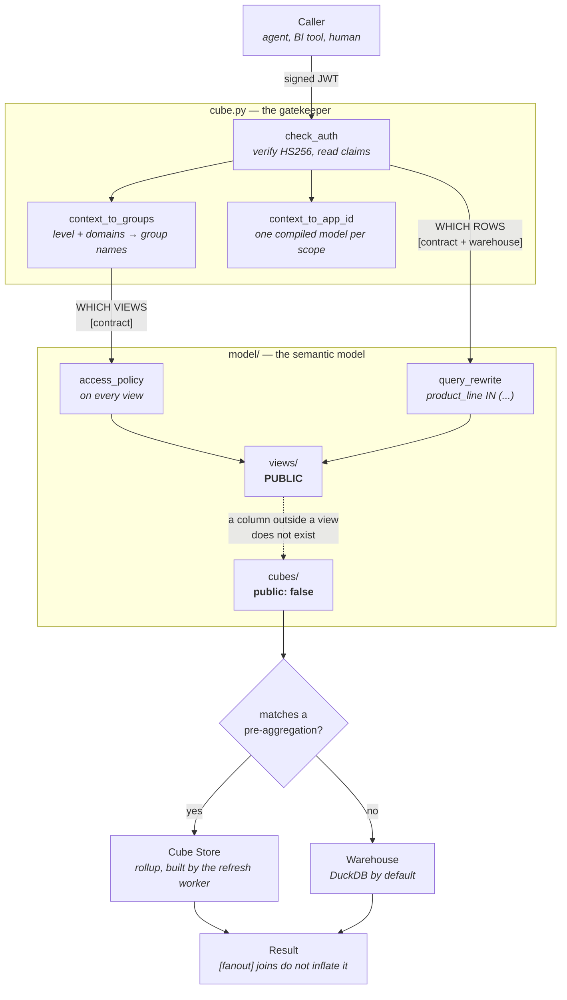

# semantic-layer — a reference Cube Core implementation

[](https://github.com/VitorFaccin/semantic-layer/actions/workflows/ci.yml)
[](LICENSE)

A **complete, working semantic layer** built on [Cube Core](https://cube.dev) (the OSS edition),
modelled for a fictional company so the *engineering* is the point and the data is not.

It exists to answer one question: **what does a governed semantic layer actually look like when
every feature is used, not just declared?** Access control on two axes, row-level security, an
abstract cube reused across business verticals, multi-stage measures, custom granularities,
pre-aggregations that queries genuinely hit, and a test suite that pins all of it.

> **On authorship.** The architecture here is mine: I designed this semantic layer end to end —
> the governance boundary, the two-axis access control, the reuse patterns, the test tiers — and
> ran a version of it in production. This repository is that design rebuilt from scratch: a
> different Cube version, a fictional company, synthetic data generated in this repo, and no
> table, metric or number from anywhere else. It looks the way it looks because this is how I
> build a semantic layer.
>
> The details that read as oddly specific — commission repeated per installment, NULL as
> semantics, a `group_by` that pins a denominator — are the lessons that survived contact with
> real data, and each one is pinned by a test.

> **The company:** *Meridian Supply*, a B2B distributor that sells appliances, furniture and
> electronics through independent sales reps, and buys from suppliers. Every table, metric and
> domain below is that business. There is no real warehouse behind it.

---

## The one rule everything else follows

**`cubes/` are private. Only `views/` are public.** A column that is not in a view **does not
exist** for whoever is querying — the AI agent included. That single boundary is what makes the
rest of the governance enforceable rather than advisory.

```
model/cubes/   public: false   ← where the SQL, the joins and the grain live
model/views/   public          ← the curated storefront: what a consumer may ask for
```

---

## Cube features, and where each one lives

Most rows are pinned by a test in `tests/contract/test_cube_features.py`; the governance and
access rows live in `test_contract_core.py` and `test_access_policy.py`. The two Jinja rows are
covered indirectly — if a macro or a global function breaks, the model does not compile.

| Feature | Where it lives | What it buys you |
|---|---|---|
| **Private cubes / public views** | all of `model/` | the governance boundary above |
| **`extends` (abstract cube)** | `model/cubes/_base/base_deal_pipeline.yml` → the 3 `base_operational_*` | one definition of "deal pipeline", inherited by every product line — descriptions included |
| **`access_policy` + groups** | every view; `cube.py` › `context_to_groups` | view **visibility** per level and per domain |
| **`query_rewrite` (RLS)** | `cube.py` | **row** filter by product line, applied per query |
| **Multitenancy / cache isolation** | `cube.py` › `context_to_app_id` | one compiled model + cache per security scope, so scopes cannot leak |
| **`pre_aggregations`** | `base_sales`, `base_orders`, `base_subscription_charges` | matching queries read Cube Store instead of the warehouse |
| **`scheduled_refresh_contexts`** | `cube.py` | the refresh worker knows which scope to materialise under |
| **Multi-stage: `time_shift`** | `base_sales.revenue_prior_period` | prior-period comparison computed in-engine, not client-side |
| **Multi-stage: `group_by`** | `base_sales.revenue_of_line` → `revenue_share_of_line` | share-of-total: the denominator is pinned to a wider grain than the query's |
| **`rolling_window`** | `base_sales.revenue_trailing_12m` | trailing windows without a date-spine join |
| **Custom `granularities`** | `base_sales.sold_at` → `commercial_week`, `fiscal_quarter` | the business calendar, not the Gregorian one |
| **`hierarchies`** | `base_reps`, `base_products` | a declared drill-down path instead of a guessed one |
| **Nested `folders`** | `sales` view ("Análise temporal" inside "Medidas — comissão") | a map of a wide view, as a tree |
| **`segments`** | most views | named, reviewed filters — and they **cannot** bypass RLS |
| **Jinja macros** | `model/macros.jinja` | repeated YAML blocks (measure trios, the rep attribute block) |
| **Jinja Python functions** | `model/globals.py` | business *rules* (table naming, validity predicates) |

---

## How a request flows

Everything below is enforced, not documented — the tier in brackets is the test that proves it.



Two properties this diagram is really about:

- **Visibility and rows are separate gates.** `access_policy` decides which views you can see;
  `query_rewrite` decides which rows come back. A view you can open still filters underneath —
  and a segment you choose cannot switch that filter off.
- **The storefront is the boundary.** Private cubes never appear in `/meta`, so a column outside
  a view is not "hidden" from the caller — it does not exist for them.

---

## Access control

Two axes plus an override, carried in a signed JWT. Full design in
[`docs/access-control.md`](docs/access-control.md); the model itself is
[`rbac.py`](rbac.py).

| Axis | Governs | Enforced by |
|---|---|---|
| `level` (10/20/30/40) | **breadth** — a view declares a minimum level | `access_policy` |
| `domains` (`appliances`, `furniture`, `electronics`, `suppliers`) | **which business domains** | `access_policy` on domain views, **row filter** on transversal ones |
| `is_admin` | override | short-circuits both |

Two properties worth calling out, because both are tested:

- **It fails closed.** A domain that maps to no product line (`suppliers`) gets a *deny-all*
  predicate on revenue views — never an unfiltered query.
- **Segments cannot bypass the row filter.** A segment is a filter the *caller* chooses; RLS
  still ANDs onto it. That is the first bypass anyone tries.

---

## Structure

```
semantic-layer/
├── cube.py                 # runtime: check_auth, context_to_groups, query_rewrite, cache scoping
├── rbac.py                 # single source of truth for levels, domains and their mapping
├── model/
│   ├── cubes/              # PRIVATE — 23 cubes
│   │   ├── _base/          #   abstract cube reused by the verticals via `extends`
│   │   ├── commercial/     #   transversal core: sales, orders, quotes, commissions, funnel,
│   │   │                   #   products, customers, reps, rep_events
│   │   ├── appliances/     #   ┐
│   │   ├── furniture/      #   ├ one pipeline + one ranking cube per product line
│   │   ├── electronics/    #   ┘
│   │   ├── suppliers/      #   supply-side performance
│   │   ├── network/        #   leads and lead events
│   │   ├── subscription/   #   recurring charges and renewals
│   │   ├── growth/         #   acquisition metrics
│   │   └── engagement/     #   rep logins
│   ├── views/              # PUBLIC — 22 views, mirroring the areas above
│   ├── globals.py          # Jinja Python functions (business rules)
│   └── macros.jinja        # Jinja macros (YAML blocks)
├── docs/
│   ├── access-control.md          # the RBAC/RLS design in full
│   ├── semantic-layer-patterns.md # how to reuse logic: extends vs macros vs globals
│   └── description-style-guide.md # how members are documented for LLM discovery
├── warehouse/              # the schema the model expects, and the data to fill it
│   ├── build_schema.py     #   derives the DDL FROM model/cubes/**
│   ├── ddl/schema.sql      #   23 tables, 213 columns — generated
│   ├── Dockerfile          #   the compose `seed` service, run before Cube
│   └── seed/
│       ├── generate.py     #   deterministic data generator -> CSV
│       └── load_duckdb.py  #   builds warehouse/meridian.duckdb
├── tests/                  # pytest, tiered by what each tier needs (see below)
│   ├── contract/           #   compile, governance, RBAC/RLS, Cube features
│   ├── test_smoke.py       #   every member answers
│   ├── test_fanout.py      #   joins do not inflate totals
│   └── test_parity.py      #   the layer's number IS the source's number
├── mcp_gateway/            # FastAPI gateway exposing the layer to an AI agent over MCP
├── scripts/lint_model.py   # renders the Jinja and rejects duplicated YAML keys
├── .github/workflows/      # CI: lint job + full test job
├── Dockerfile              # all-in-one image: embedded Cube Store + API + inline refresh
└── docker-compose.yml      # local: seed -> cube -> gateway
```

**Transversal vs vertical** is deliberate and preserved throughout: the transversal views
(`sales`, `orders`, …) span every product line and are cut by the **row filter**; the vertical
views (`operational_*`, `ranking_rep_*`) exist once per line and are cut by **visibility**.

---

## Run it locally

```bash
cp .env.example .env
docker compose up --build
```

That is the whole setup — **no cloud project, no credentials**. The `seed` service builds a local
DuckDB warehouse first (schema derived from the model, data from a deterministic generator), then
Cube starts against it. The Playground comes up at **http://localhost:4000**, REST at
`/cubejs-api/v1`, GraphQL at `/cubejs-api/graphql`, and the SQL API (Postgres wire protocol)
on **15432**.

A REST query — revenue and sales per product line, by month:

```json
{
  "query": {
    "measures": ["sales.total_sale_amount", "sales.sales_count"],
    "dimensions": ["sales.product_line"],
    "timeDimensions": [{ "dimension": "sales.sold_at", "granularity": "month" }]
  }
}
```

```
2025-01  Appliances   R$ 1,461,317.64  (63 vendas)
2025-01  Furniture    R$ 1,409,273.84  (60 vendas)
2025-01  Electronics  R$ 1,355,952.52  (60 vendas)
```

**How it resolves:** the API compiles the query → if a pre-aggregation matches, it is served from
the embedded Cube Store; otherwise the warehouse is queried. Refresh runs inline in the same
container (`CUBEJS_REFRESH_WORKER=true`), with no dedicated worker. Swap `/v1/load` for `/v1/sql`
on any query to see the SQL the engine *would* run, without running it.

> **The data is generated, not real.** 23 tables and 213 columns, ~90k rows, from a fixed seed —
> same input, byte-identical output, which is what lets a test assert on a number. It also
> deliberately reproduces the traps the model documents (commission repeated per installment,
> NULL-as-semantics, child orders). See [`warehouse/README.md`](warehouse/README.md).

**Pointing it at a real warehouse** takes two edits: set `CUBEJS_DB_*` for your engine, and set
`WAREHOUSE` in `model/globals.py` to your project prefix — `table()` exists so that is one line.

### MCP / AI agents

Cube Core's native interfaces are REST, SQL and GraphQL — **MCP is a Cube Cloud feature and does
not exist in Core**. `mcp_gateway/` is a small FastAPI service that closes that gap: it exposes
agent-facing tools and translates them into REST calls, carrying the caller's identity through
so RBAC and RLS apply to the agent exactly as they do to a human.

---

## Tests

Tiered by what each tier *needs*, so the cheap ones can run anywhere:

| Tier | Tests | Needs | Checks |
|---|---|---|---|
| `contract` | 183 | Cube up | model compiles, storefront is closed, naming, docs quality, PII confinement, **RBAC on both axes**, and every feature in the table above |
| `smoke` | 66 | Cube up **+ warehouse** | every public measure, segment and time dimension actually answers |
| `fanout` | 8 | Cube up **+ warehouse** | a joined dimension never inflates an additive total |
| `warehouse` | 17 | warehouse | **parity**: the number the layer reports is the number in the source |

```bash
python -m pytest -m contract      # runs with no warehouse at all
python -m pytest                  # everything
```

## Quality gates

`.github/workflows/ci.yml` runs two jobs on every push and pull request:

| Job | Checks |
|---|---|
| **lint** (no Docker, <1 min) | `ruff` · `scripts/lint_model.py` · `yamllint` · line endings are LF |
| **test** | builds the warehouse, boots Cube against it, runs both suites in full |

Two of those deserve a note:

- **`scripts/lint_model.py` exists because yamllint cannot read the model.** Every file under
  `model/` is a Jinja template, so a generic YAML linter dies on `` before checking
  anything — and the failure that actually bites here is a **duplicated key**, which PyYAML
  silently accepts (last one wins) and Cube rejects at boot with `duplicated mapping key`. The
  script renders the Jinja the way Cube does, then parses with a loader that refuses duplicates.
- **The test job waits for the pre-aggregations to build.** A query matching a rollup *fails*
  until the refresh worker has materialised it — seeing the rollup in the generated SQL proves
  routing, not materialisation.

The same gates run locally via [pre-commit](.pre-commit-config.yaml):

```bash
pip install pre-commit && pre-commit install
```

**274 tests.** The `contract` tier is the one that needs no data at all: visibility is metadata,
and the row filter is proven by reading the SQL Cube *generates* — via `/v1/sql` — without
executing it. That is what keeps it runnable against a Cube with no credentials.

The `warehouse` tier is the one that matters most for a *semantic* layer, because everything else
proves the model is well-formed and only this proves it is **correct**: each case computes a
number twice, once through Cube and once straight from the source, and asserts they agree. It also
pins the modelling decisions themselves — that summing commission at installment grain over-counts
(which is why the canonical total is read at sale grain), that the canonical order count really
does exclude children and self-purchases, and that a domain analyst's total equals their product
line's total **to the cent**.

---

## Pre-aggregations

Three rollups are declared, and a matching query provably hits them (asserted in
`test_declared_pre_aggregations_are_used_by_a_matching_query`):

| Cube | Rollup | Serves |
|---|---|---|
| `base_sales` | revenue + commission + count × `product_line` × month | monthly revenue by product line |
| `base_orders` | order count × `product_line` × month | monthly order volume |
| `base_subscription_charges` | charges × month | recurring revenue series |

Two things to know before adding more: **non-additive measures do not roll up** (count-distinct
and ratios need approximate variants or must be declared out), and because multitenancy keys the
cache per scope, the refresh worker needs a `scheduled_refresh_contexts` entry per scope it
should materialise — one admin scope covers all three above, since they are built unfiltered and
every narrower scope reads the same partitions.

---

## Conventions

- Cubes are `base_*` and private; views are the business term, plural, and public.
- Member names are `snake_case`; YAML is 2-space indented.
- **Member descriptions are in Portuguese** (they are the business semantics an agent relays to a
  user); **everything else — READMEs, comments, docstrings — is in English.** See
  [`docs/description-style-guide.md`](docs/description-style-guide.md).
- Reuse in order of preference: `extends` → `macros.jinja` → `globals.py`.

### Two traps worth writing down

- **A duplicated YAML key passes a Python `yaml.safe_load` and then breaks Cube.** PyYAML keeps
  the last duplicate; the `js-yaml` Cube uses raises `duplicated mapping key` and the *whole*
  model fails to compile. Validating an edit means booting the model, not parsing the file.
- **Cube JSON-quotes any interpolated Jinja value.** Write `sql_table: {{ table(...) }}`, never
  `sql_table: "{{ table(...) }}"` — the latter renders as `""dataset.table""` and the YAML dies.

---

## License

[MIT](LICENSE) — use it, fork it, copy the patterns.
